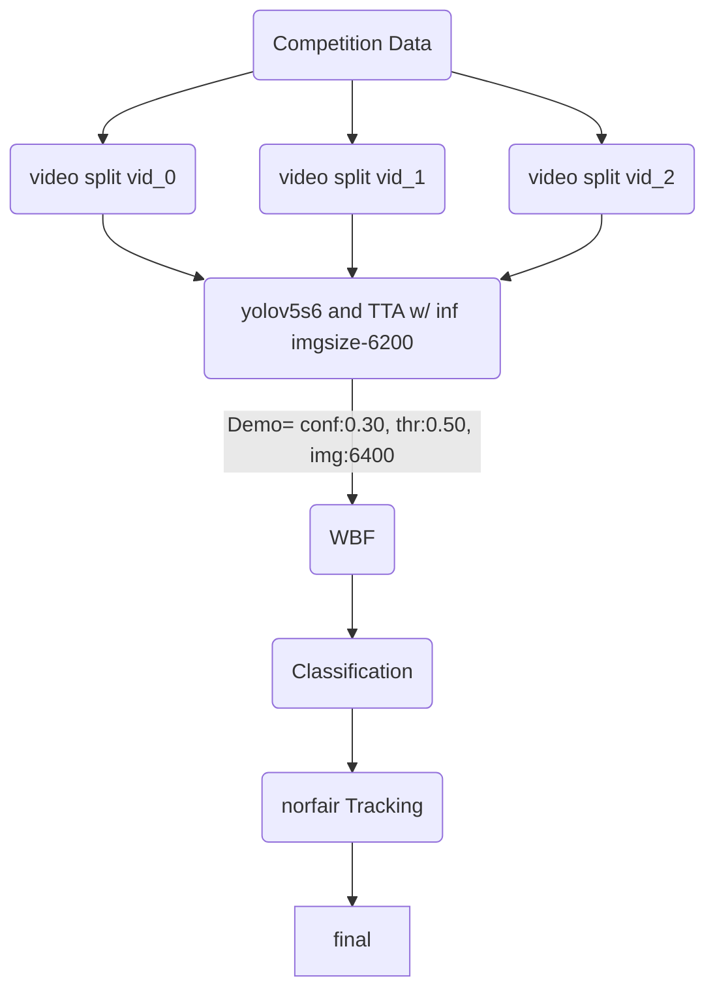

# Introduction: 
The goal of this competition is to accurately identify starfish in real-time by building an object detection model trained on underwater videos of coral reefs.
Me and my teammate started early and contributed with few Notebook and discussion threads, but as the deadline for the overlapping competition `Sartorius -CIS` was approaching 
we had to shift our focus toward that. We got started with the competiion after the 31st Dec. It took some time to digest all the things that were happening, [im still reading the solutions, and some code 😅.]. This was a very successful competition [also sartorius], total of 2,026 teams and 61,174 submissions. People shared there ideas and code massively, because of that it was a great start for a beginner like me, because I got to learn a lot of things. With the help of the community our team was able to get in top 3% of the LB and had a silver medal [we were expecting Bronze]. Here I will be discussing about my experiments. I created a lot of NBs in this competition, and from that I tried to compile most of the NBs that are important. Here you will find some forked NBs(with modification) and some independent NBs. If I missed something please create an issue and ask there.

## Few Ideas That I tried:
- Most of the ideas were proposed on the Discussion forums
### Use Single yolov5:
- When I got to yolov5 it was clear that yolov5 is FTW. But there were conflits on which version to use yolov5s6 or yolov5m6. Because some were getting better results on one of them. 
   - I first started with 2 stage detector FasterRCNN, I tried different backbones and hyper-params with different augmentation techniques[geometric and colog and combined]. I tried ResNet101,ResNet50,MobileNet,EfficientB3,SwinTransformer. Check out this amazing repository by [@mrinath](https://github.com/mrinath123), it helped for efficient with timm [timmFasterRcnn](https://github.com/mrinath123/timmFasterRcnn/).

   -  **I started with 3fold yolov5s6** It was a video based splitting. As per my analysis it was most likely that video_id2 would give more better f2, because it has more data, and there were varience in the data. I tried different hyper parameters in that, and different training image resolutions. I tried doing ensemble after training each fold. I did the same with yolov5m6. I found out Adam was working better SGD. I also did some experiments with custom augmentation using albumentations. 
    
   -  After seeing some discussion on yolov5 model freesing, I thought of trying that, and for this best splitting was sequence based groupfold. for more check out [ultralytics docs](https://docs.ultralytics.com/tutorials/transfer-learning-froze-layers/). I trained both yolov5s6 and yolov5m6. image size was +/-3000.
    
   - Along with yolov5, tracking was doing a better job increasing the CV/LB. I also tried that. I used norfair tracking. I saw some discussions on different tracking to use, like deep sort and so, but ended up using the norfair one as it was giving decent results and I did not had much time.
   - As a postprocessing technique I also tried to use classification on the bounding boxes. It also helped. I tried different models Normal CNN, Densenet121, Resnet [50,101], Efficientnet[B3] and ensemble. Our demo pipeline looks like this,
   

# NB tracking

|training NB|Inference NB|
|-------|-------|
|[reef-frcnn-resnet50-on-4k.ipynb](training/reef-frcnn-resnet50-on-4k.ipynb) [kaggle]()|[reef-frcnn-resnet50-on-4k-infr.ipynb](inference-NBs/reef-frcnn-resnet50-on-4k-infr.ipynb)|
|[frcnn-with-efficientnetv3-timm.ipynb](training/frcnn-with-efficientnetv3-timm.ipynb)| --- |
|[fasterrcnn-resnet101.ipynb](training/fasterrcnn-resnet101.ipynb)| --- |
|[learning-to-torch-fasterrcnn-pytorch.ipynb](training/learning-to-torch-fasterrcnn-pytorch.ipynb) [`kaggle`](https://www.kaggle.com/soumya9977/learning-to-torch-fasterrcnn-pytorch)| --- |
|[FasterRCNN[train]-color+geo aug-480p-SGD-90:10-e20](training/fasterrcnn-train-color-geo-aug-480p-sgd-90-10-e20.ipynb) [`kaggle`](https://www.kaggle.com/soumya9977/fasterrcnn-train-color-geo-aug-480p-sgd-90-10-e20)|[learning-to-torch-fasterrcnn-infer.ipynb](inference-NBs/learning-to-torch-fasterrcnn-infer.ipynb) [`kaggle`](https://www.kaggle.com/soumya9977/learning-to-torch-fasterrcnn-infer)|
|[trained yolov5s6 [img1920,bs2,e7] on fold 1 w/ evolve params](training/yolov5-train.ipynb)|[yolov5-inference-nb.ipynb](inference-NBs/yolov5-inference-nb.ipynb)|
|[somu: yolov5s6[train1] base model [1 of 5 folds]](training/somu-yolov5s6-train1-base-model-1-of-5-folds.ipynb)| --- |
|[somu: yolov5s6 video_fold vid_id:1](training/somu-yolov5s6-video-fold-vid-id-1.ipynb)||
|[somu: yolov5s6 video_fold vid2](training/somu-yolov5s6-video-fold-vid2.ipynb)||
|[somu: yolov5s6 video_fold vid2 [evolve]❌](training/somu-yolov5s6-video-fold-vid2-evolve.ipynb)||
|[yolov5m6 frcnn_albumentations vid2 [no cp]](training/yolov5m6-frcnn-albumentations-vid2-no-cp.ipynb)||
|[yolov5m6 vid:2 adam](training/yolov5m6-vid-2-adam.ipynb)||
|[classification starfish](training/classification-starfish.ipynb)||
|[FasterRCNN[train]coloraug-480p-SGD/AdamW-90:10-e20](training/fasterrcnn-train-coloraug-480p-sgd-adamw-90-10-e20.ipynb)||
|[yolov5 Albumentations [train]](training/yolov5-albumentations-train.ipynb)||
|[Evaluate F2 for YoloX and Norfair tracking](training/evaluate-f2-for-yolox-and-norfair-tracking.ipynb)||
|[yolov5[train1] base model [1 of 5 folds]](training/yolov5-train1-base-model-1-of-5-folds.ipynb)||
|[somu: yolov5s6 video_fold vid2](training/somu-yolov5s6-video-fold-vid2%20%281%29.ipynb)||
|[somu: yolov5s6 video_fold vid2, copypaste:0.5](training/somu-yolov5s6-video-fold-vid2-copypaste-0-5.ipynb)||
|[resume yolov5m6 vid2](training/resume-yolov5m6-vid2.ipynb)||
|[somu: yolov5s6 video_fold vid0](training/somu-yolov5s6-video-fold-vid0.ipynb)||
|[yolov5m6 video fold: vid_id=2, img=3k,e11,bs2](training/yolov5m6-video-fold-vid-id-2-img-3k-e11-bs2.ipynb)||
|[yolov5m6 vid:2 adam, 3k img](training/yolov5m6-vid-2-adam-3k-img.ipynb)||
|[yolov5s6 vid:2 adam, 3584 img,cp:0.5](training/yolov5s6-vid-2-adam-3584-img-cp-0-5.ipynb)||
|[FasterRCNN:resnet50,90/10,e12,bs8,SGD,cnf0.15,i480](training/fasterrcnn-resnet50-90-10-e12-bs8-sgd-cnf0-15-i480.ipynb)||
|[FasterRCNN[train]-geoaug-480p-SGD-90:10](training/fasterrcnn-train-geoaug-480p-sgd-90-10.ipynb)||

### IMP NBs:
---
- [yolov5 Ensembling NMS-Soft_NMS-NMW-WBFLB 8cce28](inference-NBs/yolov5-ensembling-nms-soft-nms-nmw-wbf-lb-8cce28.ipynb)
- [figuring out aug [Norm values]](post-processing/figuring-out-aug-norm-values.ipynb) [`private-kaggle`](https://www.kaggle.com/soumya9977/figuring-out-aug-norm-values)
- [Learning to Sea: Underwater img Enhancement + EDA](post-processing/learning-to-sea-underwater-img-enhancement-eda.ipynb) [**`public-kaggle`**](https://www.kaggle.com/soumya9977/learning-to-sea-underwater-img-enhancement-eda)
- [somu: Evaluate F2 for YoloV5 and Norfair tracking](metric-calculation/somu-evaluate-f2-for-yolov5-and-norfair-tracking.ipynb)
- [competition metric implementation](metric-calculation/competition-metric-implementation.ipynb)
- [competition metric implementation clone, w/ some fix: reef-model-cv-check](tf-reef_experiment_compilation/metric-calculation/reef-model-cv-check.ipynb) 
- [f2 calculation for FasterRCNN](metric-calculation/fasterRCNN-f2-eval.py)
<!-- - [yolov5+yolox+ensemble+tracking](inference-NBs/yolov5-yolox-ensemble-tracking-f1cd34.ipynb) -->

### YOLO Inference NBs:
---
- [StarFish-V3 [yolov5 ensemble + tracking]](inference-NBs/starfish-v3-yolov5-ensemble-tracking.ipynb) 
- [StarFish-V3 [yolov5 + tracking]](inference-NBs/starfish-v3-yolov5-tracking.ipynb)
- [yolov5 inference | Leon-V5-infer 2.0](inference-NBs/leon-v5-infer-2-0-lb-0-665.ipynb)

# Reef Experiments
## 1. FasterRCNN resnet50:
<!-- **Params:**
resnet50,90/10,e12,bs8,SGD,lr_sch,conf:0.15,480p,labeled data, No augmentation
 -->
**Inference NB:** https://www.kaggle.com/soumya9977/learning-to-torch-fasterrcnn-infer

Experiment log FasterRCNN:

| Version | model      |  file used                      | link  | CV/LB        |
| ------- | ---------- |  ------------------------------ | ----- | ------------ |
| v9      | fasterRCNN | fasterrcnn_resnet50_fpn-e10.pt | [NB](https://www.kaggle.com/shivamaranya/fasterrcnn-resnet50-90-10-e12-bs8-sgd-cnf0-25-i480) | 0.461/0.285  |
| v12     | fasterRCNN | fasterrcnn_resnet50_fpn-e9.pt  | [NB](https://www.kaggle.com/shivamaranya/fasterrcnn-resnet50-90-10-e12-bs8-sgd-cnf0-25-i480) | 0.461/~0.285 |
| v10     | fasterRCNN | fasterrcnn_resnet50_fpn-e11.pt | [NB](https://www.kaggle.com/shivamaranya/fasterrcnn-resnet50-90-10-e12-bs8-sgd-cnf0-25-i480) | 0.459/0.285  |
| v13     | fasterRCNN | fasterrcnn_resnet50_fpn-e8.pt  | [NB](https://www.kaggle.com/shivamaranya/fasterrcnn-resnet50-90-10-e12-bs8-sgd-cnf0-25-i480) | 0.460/0.288  |
| v11     | fasterRCNN | fasterrcnn_resnet50_fpn-e6.pt  | [NB](https://www.kaggle.com/shivamaranya/fasterrcnn-resnet50-90-10-e12-bs8-sgd-cnf0-25-i480) | 0.457/0.291  |%%

---

  

Experiment log FasterRCNN:

| Version | model                                                                                             | file used                      | link                                                                                         | CV/LB                            |
| ------- | ------------------------------------------------------------------------------------------------- | ------------------------------ | -------------------------------------------------------------------------------------------- | -------------------------------- |
| v9      | fasterRCNN resnet50,90/10,e12,bs8,SGD,cnf0.15,i480                                                | fasterrcnn_resnet50_fpn-e10.pt | [NB](https://www.kaggle.com/shivamaranya/fasterrcnn-resnet50-90-10-e12-bs8-sgd-cnf0-25-i480) | 0.461/0.285                      |
| v12     | fasterRCNN ................... same as above                                                      | fasterrcnn_resnet50_fpn-e9.pt  | [NB](https://www.kaggle.com/shivamaranya/fasterrcnn-resnet50-90-10-e12-bs8-sgd-cnf0-25-i480) | 0.461/~0.285                     |
| v10     | fasterRCNN ................... same as above                                                      | fasterrcnn_resnet50_fpn-e11.pt | [NB](https://www.kaggle.com/shivamaranya/fasterrcnn-resnet50-90-10-e12-bs8-sgd-cnf0-25-i480) | 0.459/0.285                      |
| v13     | fasterRCNN ................... same as above                                                      | fasterrcnn_resnet50_fpn-e8.pt  | [NB](https://www.kaggle.com/shivamaranya/fasterrcnn-resnet50-90-10-e12-bs8-sgd-cnf0-25-i480) | 0.460/0.288                      |
| v11     | fasterRCNN ................... same as above                                                      | fasterrcnn_resnet50_fpn-e6.pt  | [NB](https://www.kaggle.com/shivamaranya/fasterrcnn-resnet50-90-10-e12-bs8-sgd-cnf0-25-i480) | 0.457/0.291                      |
| v16     | fasterRCNN resnet50,90/10,e12,bs8,SGD,cnf0.15,i480,geo aug                                        | fasterrcnn_resnet50_fpn-e6.pt  | [NB](https://www.kaggle.com/shivamaranya/fasterrcnn-train-geoaug-480p-sgd-90-10)             | 0.467/0.274                      |
| v17     | fasterRCNN resnet50,90/10,e20,bs8,SGD,cnf0.15,i480,color aug                                      | fasterrcnn_resnet50_fpn-e6.pt  | [NB](https://www.kaggle.com/shivamaranya/fasterrcnn-train-coloraug-480p-sgd-90-10-e20/)      | 0.407/0.382                      |
| v18     | fasterRCNN resnet50,90/10,e20,bs8,SGD,cnf0.15,i480,color aug                                      | fasterrcnn_resnet50_fpn-e20.pt | [NB](https://www.kaggle.com/shivamaranya/fasterrcnn-train-coloraug-480p-sgd-90-10-e20/)      | 0.407/0.291                      |
| v20     | FasterRCNN[train]-color+geo aug-480p-SGD-90:10-e20,multi conf,new train loop,bs8                  | fasterrcnn_resnet50_fpn-e11.pt | [NB](https://www.kaggle.com/soumya9977/fasterrcnn-train-color-geo-aug-480p-sgd-90-10-e20)    | 0.338/?                          |
| v21     | FasterRCNN[train]-color+geo aug-480p-SGD-90:10-e20,multi conf,new train loop,bs8                  | fasterrcnn_resnet50_fpn-e20.pt | [NB](https://www.kaggle.com/soumya9977/fasterrcnn-train-color-geo-aug-480p-sgd-90-10-e20)    | 0.338/0.184                      |
| v22     | fasterRCNN resnet50,90/10,e20,bs8,SGD,cnf0.15,i480,color aug **[inf imgSize2400]**                | fasterrcnn_resnet50_fpn-e6.pt  | [NB](https://www.kaggle.com/shivamaranya/fasterrcnn-train-coloraug-480p-sgd-90-10-e20/)      | 0.407/0.00 [problem in the code] |
| v23     | fasterRCNN resnet50,90/10,e16,bs8,AdamW,cnf0.15,i480,color aug **[save_multy: future_resume]**    | fasterrcnn_resnet50_fpn-e7.pt  | [NB](https://www.kaggle.com/shivamaranya/fasterrcnn-train-coloraug-480p-sgd-adamw-90-10-e20) | 0.382/?                          |
| v24     | fasterRCNN resnet50,90/10,e16,bs8,AdamW,**cnf0.1**,i480,color aug **[save_multy: future_resume]** | fasterrcnn_resnet50_fpn-e7.pt  | [NB](https://www.kaggle.com/shivamaranya/fasterrcnn-train-coloraug-480p-sgd-adamw-90-10-e20) | 0.382/?                          |
|         |                                                                                                   |                                |                                                                                              |                                  |
|         |                                                                                                   |                                |                                                                                              |                                  |
---

Experiment log YOLOV5:

## 2. YOLOV5 table:
| version                                                                                               | config                                                                                                                                 | iou & conf | img_size[train/test] | epoch used | CV/LB      |
| ----------------------------------------------------------------------------------------------------- | -------------------------------------------------------------------------------------------------------------------------------------- | ---------- | -------------------- | ---------- | ---------- |
| [starfish-v17](https://www.kaggle.com/soumya9977/starfish-v3?scriptVersionId=87204749)                | <mark style="background: #ABF7F7A6;">[tracking,tta]</mark> 1/5 fold,<mark style="background: #FFB86CA6;">yolos6</mark> ,3000,e11,bs2   | 0.4,0.28   | 1920 x 3             | best.pt    | 0.81/0.571 |
| [starfish-v16](https://www.kaggle.com/soumya9977/starfish-v3?scriptVersionId=87159560)                | <mark style="background: #ABF7F7A6;">[tracking,tta]</mark> Good Moon model <mark style="background: #FFB86CA6;">yolos6</mark>                                                            | ""         | 6400                 | f2_sub.pt  | ?/0.647    |
| [starfish-v15](https://www.kaggle.com/soumya9977/starfish-v3?scriptVersionId=87157847)                | <mark style="background: #ABF7F7A6;">[tracking,tta]</mark> Good Moon model <mark style="background: #FFB86CA6;">yolos6</mark>              | ""         | 1920 x 3             | f2_sub.pt  | ?/0.641    |
| [Leon-V5 - v3](https://www.kaggle.com/soumya9977/leon-v5-infer-2-0-lb-0-665?scriptVersionId=87157056) | <mark style="background: #ABF7F7A6;">[no tracking, tta]</mark> Good Moon model  <mark style="background: #FFB86CA6;">yolos6</mark>| ""         | 10000                | f2_sub.pt  | ?/0.432    |
| [Leon-V5 - v4](https://www.kaggle.com/soumya9977/leon-v5-infer-2-0-lb-0-665?scriptVersionId=87157070) | <mark style="background: #ABF7F7A6;">[no tracking, tta]</mark> Good Moon model <mark style="background: #FFB86CA6;">yolos6</mark>    | 0.4,0.20   | 10000                | f2_sub.pt  | ?/0.424    |
| [Leon-V5 - v1](https://www.kaggle.com/soumya9977/leon-v5-infer-2-0-lb-0-665?scriptVersionId=87137694) | <mark style="background: #ABF7F7A6;">[no tracking, tta]</mark> Good Moon model <mark style="background: #FFB86CA6;">yolos6</mark>      | 0.50,0.30  | 6400                 | f2_sub.pt  | ?/0.665    |
| [Leon-V5 - v2](https://www.kaggle.com/soumya9977/leon-v5-infer-2-0-lb-0-665?scriptVersionId=87151602) | <mark style="background: #ABF7F7A6;">[no tracking, tta]</mark> Good Moon model <mark style="background: #FFB86CA6;">yolos6</mark>       | 0.4,0.28   | 6400                 | f2_sub.pt  | ?/0.665    |
| [starfish-v13](https://www.kaggle.com/soumya9977/starfish-v3?scriptVersionId=87078723)                | <mark style="background: #ABF7F7A6;">[tracking,tta]</mark> 1/5 fold,<mark style="background: #FFB86CA6;">yolov5s5</mark> ,3000,e11,bs2 | 0.4,0.28   | 1920 x 3             | best.pt    | 0.76/0.588 |
| [starfish-v12](https://www.kaggle.com/soumya9977/starfish-v3?scriptVersionId=87078723)                | <mark style="background: #ABF7F7A6;">[tracking,tta]</mark> 1/5 fold,<mark style="background: #FFB86CA6;">yolov5s5</mark> ,3000,e11,bs2 | 0.4,0.15   | 1920 x 3             | best.pt    | 0.76/0.580 |
| [starfish-v07](https://www.kaggle.com/shivamaranya/yolov5-albumentations-train)|<mark style="background: #ABF7F7A6;">[tracking,tta]</mark> 1/5 fold,<mark style="background: #FFB86CA6;">yolov5s5</mark> ,3000,e11,bs2 | 0.4,0.28   | 1920 x 3 | best.pt    | 0.76/0.588                                                                                                                                         |            |                      |            |            |
---

Experiment log YOLOV5:

# Model cofig Log:

|version|config|epoch for sub|cv/lb|
|-------|------|-----|-----|
|v4|CONF= 0.28, IOU= 0.40, sheep's model| fold2 best|?/0.616|
|v5|yolov5s5:albu[frcnn],imgsize=3600,bs=2,e11,CONF= 0.28, IOU= 0.40| best.pt|?/0.552|
|v7|yolov5s5:albu[frcnn],imgsize=3600,bs=2,e11,CONF= 0.28, IOU= 0.40 [SAME as ☝]| epoch6.pt|0.73871/0.552|
|v8|yolov5s5:ammarnassanalhajali yolov5| best.pt|?/?|
|v10|yolov5s5:[[BASE MODEL](https://www.kaggle.com/shivamaranya/yolov5-train1-base-model-1-of-5-folds?scriptVersionId=87048518)] imgsize=3600,bs=2,e11,CONF= 0.28, IOU= 0.40 | best.pt|0.76../0.588|
|v12|yolov5s5:[[BASE MODEL](https://www.kaggle.com/shivamaranya/yolov5-train1-base-model-1-of-5-folds?scriptVersionId=87048518)] imgsize=3600,bs=2,e11,CONF= 0.15, IOU= 0.40 | best.pt|0.76../0.580|
|v12|yolov5s5:[[BASE MODEL](https://www.kaggle.com/shivamaranya/yolov5-train1-base-model-1-of-5-folds?scriptVersionId=87048518)] imgsize=3600,bs=2,e11,CONF= 0.15, IOU= 0.40 | epoch7.pt|0.76../?|
|v15|yolov5s6:[Good Moon Model] CONF= 0.28, IOU= 0.40, img size = 1980x2 | f2_sub2.pt|0.76../?|
|v16|yolov5s6:[Good Moon Model] CONF= 0.28, IOU= 0.40, img size = 6400 | f2_sub2.pt|0.76../?|
|v16|yolov5s6:[[yolov5s6](https://www.kaggle.com/shivamaranya/yolov5s6-train1-base-model-1-of-5-folds)] imgsize=3600,bs=2,e11,CONF= 0.28, IOU= 0.40 | best.pt|0.81../?|
|v18|yolov5s6:[Good Moon Model] CONF= 0.30, IOU= 0.50, img size = 6400 | f2_sub2.pt|0.76../?|
|v21|yolov5s6: Vid based split, vid:2, CONF= 0.30, IOU= 0.50, inf img size = 6400, train 3584, 6th epoch | best f2 epoch|0.89/0.620|
|v23|yolov5s6: Vid based split, vid:1, CONF= 0.30, IOU= 0.50, inf img size = 6400, train 3584, 7th epoch | best f2 epoch|0.72/0.610|
|v32|yolov5s6:[Good Moon Model] CONF=0.30,IOU= 0.50, img size = 6400 |'../input/yolov5s6/yolov5s6_sub9.pt'|?/0.680|
|v33|yolov5m6: 3584img, adam,e6,bs2,vid:2| last.pt|0.87/0.558[p]|
|v34|yolov5m6: 3k img, e6,bs2, vid:2| epoch5.pt|0.869/0.558[p]|
|v35|yolov5s6 3584img, video_fold vid2, copypaste:0.5, e10| epoch7.pt|0.88/0.625[p]|
|v36|yolov5m6 resume training, 3584img, video_fold vid2, e11| epoch9.pt|0.88/0.623[p]|

Experiment log YOLOV5:

## 3. YOLOV5m6 experiments:
yolov5m6try1-epoch5 = 0.600
yolov5m6try1-epoch3 = 0.562
yolov5s6-vid_id:0 = 0.555 [yolov5s6]

# Future work:
- Write a optuna scritp for adjusting the inference hyper-params of yolov5 
- Add some other NBs and writeups that are left.
- making the code into python scripts.
- Add model prediction video

# Random Advice to Myself:
- dont participate on multiple comps w/ overlapping timings [one at a time]
- Try to explore more fields [NLP,audio,tabular]
- use better ways to track [use WandB/google sheet]
